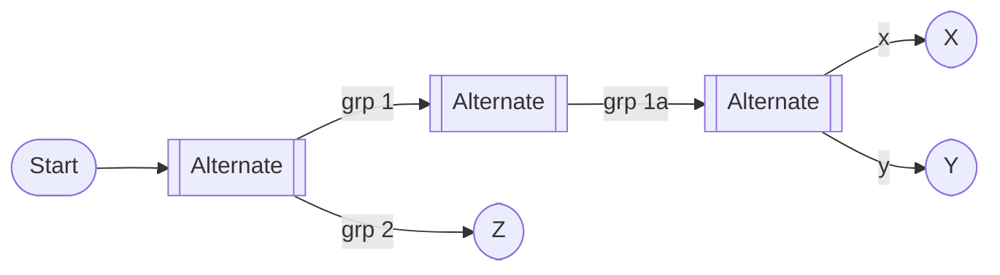

# Alternate Branch Nesting Policy — Scenarios, Decisions, and Parser Rules

Last updated: 2025-10-26

## Scope

Define what kinds of Alternate (choice) branch nesting we allow in dynamic views, what we normalize, and why. Provide concrete examples, parser rules, diagnostics, and a minimal test plan.

Targets:
- Parser (`ViewsParser.ts`) validation/normalization for `kind: 'alternate'`
- Compute layer expectations (no change if parser enforces/normalizes)
- Consistency with Parallel policy and legacy compatibility where relevant

## Definitions

- Alternate branch (A): a branch collection with `kind: 'alternate'` and `paths[]` representing mutually exclusive flows.
- Homogeneous nesting: branch of type A directly contains a single child that is also A (A within A) with no sequential steps before/after inside that path.
- Heterogeneous nesting: different types nested (e.g., P inside A or A inside P).
- Sequential alternate: an Alternate block appears as one step among others inside a path, i.e., the path has additional steps before or after the block.

## Proposed approach

- Allow homogeneous nested alternate but normalize (flatten) it: A directly wrapping A adds no behavioral semantics for our DSL. We propose accepting it and flattening inner A paths into the parent A. Prefer an informational diagnostic so authors learn about the canonical form.
- Allow sequential alternate: Paths may contain an Alternate block followed or preceded by steps ("do X, then choose among options"). This should remain valid.
- Allow heterogeneous nesting: Parallel within Alternate, or Alternate within Parallel, remains allowed (distinct semantics; not generally associative).
- Legacy compatibility: While there is no dedicated legacy form for Alternate, mirror the Parallel policy where applicable.

Rationale: In the current compute model, Alternate encodes a mutually exclusive choice among sibling paths. Nesting A-in-A is behaviorally equivalent to a single Alternate with the union of the inner paths (associative). Unlike Parallel, there’s no synchronization barrier whose placement changes behavior. Therefore, we propose permitting A-in-A and canonicalizing by flattening. An informational diagnostic would educate authors without blocking.

## Diagram symbol legend

### Legend quick visual (Mermaid)

#### Rounded node


---

#### Join (synchronization)


---

#### Parallel container with two paths


---

#### Alternate container with labeled paths


---

#### Labeled edge example


---


---

## Scenario matrix

Legend: ✓ allowed (may normalize), ⚠ allowed with info/warn, ✗ disallowed

1) Flat alternate
- A { paths: [ [A→B], [A→C] ] } → ✓

2) Homogeneous nested alternate
- A { paths: [ [ A { paths: [X, Y] } ] , [Z] ] } where the first path contains exactly one A and nothing else → ⚠ flatten inner A paths into parent (no behavioral change)
- A { paths: [ [ A { … } ] ] } i.e., every path is a single A → ⚠ flatten to one A with union of all inner paths

3) Sequential alternate
- A { paths: [ [A, A { paths: [X, Y] } ], [B] ] } → ✓ (no flattening inside the series; the inner A is one step of the series)
- A { paths: [ [A { paths: [X, Y] }, C] ] } → ✓

4) Heterogeneous nesting
- A { paths: [ [P { paths: [X, Y] } ] ] } → ✓
- P { paths: [ [A, A { paths: [X, Y] } ] ] } → ✓ (inner A is part of a parallel path)

Notes:
- "exactly one entry" means a path resolves to a single branch entry that is a branch of the same kind, and no other steps are present in that path.
- Normalization preserves path metadata where possible (see below) and has no effect on computed edges.

## Visual overview (Mermaid diagrams)

### 1) Flat alternate (allowed)


### 2) Homogeneous nested alternate (allowed; flattened)

Nested form (accepted, normalized):


Flattened canonical form (what the parser will produce):


### 3) Sequential alternate (allowed)


### 4) Heterogeneous nesting (allowed)

Parallel inside alternate (one option runs a parallel block):


Alternate inside parallel (one path chooses among two alternatives):


## Parser rule proposal

Validation/normalization point: in `parseDynamicBranchCollection` after `paths` are constructed.

- If `kind === 'alternate'`, then for each path:
  - If the path `steps` array has length 1 and that single entry is `DynamicBranchCollection` with `kind === 'alternate'`, FLATTEN the inner alternate by promoting its `paths` to the outer `paths` (preserving order), and emit an informational diagnostic.
  - Otherwise do nothing special.

Diagnostic text (proposed):
- Code: `LIKEC4-NESTED-ALTERNATE-FLAT`
- Message: "Nested alternate inside alternate was flattened into the parent alternate."
- Hint: "You can write a single alternate with all options. Group names were preserved by prefixing child path names/titles."
- Severity: info (or configurable warn)

Metadata preservation during flattening:
- If the parent path had a name/title (e.g., `grp X`) and the child path had a name/title (e.g., `x1`), derive new labels via concatenation with a separator (e.g., `grp X / x1`).
- If either side is anonymous, keep the available name/title. Ensure `pathId` uniqueness via AST-derived `astPath` as today.

Auto-fix: Not required since normalization is automatic. The diagnostic is purely informational.

### Parser decision flow


## Compute/render implications

- No changes required in compute. It treats Alternate paths independently, and normalization simply reduces redundant nesting.
- UI can display concatenated path names/titles post-flattening; no change to edge generation.

## Edge cases and additional diagnostics

1) Degenerate single-path alternate
- A with exactly one path (after filtering invalid steps) adds no choice.
- Suggested: warn (`LIKEC4-DEGENERATE-ALTERNATE`) and consider auto-flatten into the surrounding sequence (future enhancement).

2) Path name/title preservation
- When flattening, prefer `parentTitle + ' / ' + childTitle` if both exist. If only one exists, carry it over.
- Keep `pathName` similarly; if collision occurs, suffix with an index while preserving display title.

3) Duplicate path names within an alternate
- Two paths in the same Alternate share the same `pathName`.
- Suggested: error (`LIKEC4-DUP-PATH-NAME`) or warn (policy-dependent). Ensure internal `pathId` remains unique.

4) Invalid-step filtering changing structure
- Filtering out invalid steps can turn `[Step, A]` into `[A]`, enabling flattening.
- Suggested: still flatten but include extra hint in the diagnostic: "Previous invalid steps were removed, causing nested alternate to be flattened."

5) Deep heterogeneous nesting
- A→P→A→P… remains allowed. Consider a soft-limit warning (`LIKEC4-DEPTH-LIMIT`) in the future.

6) Alternate-in-parallel parity
- Ensure P-in-A and A-in-P combinations work as documented in the Parallel policy; add cross-tests.

7) Multiple sequential alternate blocks in the same path
- Path like: `[A, ALT{…}, B, ALT{…}, C]`.
- Suggested: allowed. Ensure compute emits correct branchTrail segments for edges before/between/after blocks. Add a test to cover two disjoint alternate segments in one path.

8) Duplicate (identical) steps across sibling paths
- The same step or series appears in multiple paths of an Alternate.
- Suggested: allow, but consider a low-severity warning (`LIKEC4-DUP-STEP-IN-PATHS`) if duplication is likely unintentional. Compute should register the same edge in multiple paths (by design) when branch collections feature is enabled.

9) Path metadata completeness
- Anonymous paths without name/title across many alternates can degrade UX.
- Suggested: warn when all paths are anonymous and untitled (`LIKEC4-PATH-METADATA-MISSING`), recommending adding `name` or `title` for clarity.

10) Unicode and whitespace in titles/names
- Titles with newlines, excessive whitespace, or exotic Unicode.
- Suggested: normalize whitespace (trim, collapse sequences) and allow Unicode. Warn on control characters.

11) Cross-branch cycles
- Cycles formed by edges across paths or branches.
- Suggested: out-of-scope for parser; leave to higher-level graph validation. Optionally surface a warning if an obvious cycle is detected during parse (if cheap), otherwise defer.

12) Multi-level flattening and order stability
- Deep A-in-A-in-A chains should be flattened recursively.
- Preserve path order deterministically (depth-first, as encountered) and compose titles consistently (`parent / child`). Document title derivation precedence and truncation policy.

## Edge case diagrams (Mermaid)

### 1) Degenerate single-path alternate (warn, consider flatten)


Single path under Alternate adds no choice; consider flattening `Only` into the surrounding sequence.

### 2) Duplicate path names within an alternate (error or warn)


Two paths share the same `pathName` (foo).

### 3) Invalid-step filtering changing structure (before vs after)

Before filtering (sequential, allowed):


After filtering out `Step` (degenerates to ALT-only path; if nested inside an outer Alternate path, it will be flattened):


If this ALT appears as the only entry inside a parent Alternate path, the parser will flatten it into the parent.

### 4) Extremely large fan-out (warn beyond threshold)


Warn when fan-out exceeds a configurable threshold.

### 5) Multiple sequential alternate blocks in one path (allowed)


### 6) Duplicate steps across sibling paths (allowed; optional warn)


Both paths reference the same conceptual step series X→Y.

### 7) Multi-level flattening and order stability (accepted; flattened)

Nested form (accepted, normalized):



Flattened canonical form (title composition preserves grouping):

```mermaid
flowchart LR
  S([Start]) --> A[[Alternate]]
  A -->|grp 1 / grp 1a / x| X([X])
  A -->|grp 1 / grp 1a / y| Y([Y])
  A -->|grp 2| Z([Z])
```

### 8) Cross-branch cycles (out-of-scope for parser)

```mermaid
flowchart LR
  S([Start]) --> ALT[[Alternate]]
  ALT --> A([A])
  ALT --> B([B])
  A --> T([Then])
  B --> T
  T --> A
```

Cycle involves elements across different paths; handle in higher-level graph validation.

## Test plan (minimal)

Happy path
- parse: A with two simple paths → OK.
- parse: A with sequential alternate in one path (step, then A) → OK.
- parse: P with nested A inside a path → OK.

Normalization
- parse: A with path [A {...}] → diagnostic `LIKEC4-NESTED-ALTERNATE-FLAT`, AST normalized to a single A with union of child paths.
- parse: A with all paths [A {...}] only → single A with union of all inner paths; diagnostic once per flattened path.

Edge/metadata
- path names/titles concatenate correctly when flattening (snapshots verifying "parent / child").
- duplicates handled (either error/warn, per policy above).

Snapshots/fixtures
- Include before/after examples for flattening with and without names/titles.

## Examples (conceptual)

Homogeneous alternate (accepted, flattened):

```
alternate {
  paths: [
    [ alternate { paths: [ [A→B], [C→D] ] } ],
    [ E→F ]
  ]
}
```

Flattened canonical form:

```
alternate {
  paths: [
    [ A→B ],
    [ C→D ],
    [ E→F ]
  ]
}
```

Sequential alternate (keep as-is):

```
alternate {
  paths: [
    [ A→B, alternate { paths: [ [C→D], [E→F] ] } ],
    [ G→H ]
  ]
}
```

## Next steps

- Implement Alternate flattening in `ViewsParser.parseDynamicBranchCollection` when a path degenerates to a single nested Alternate.
- Emit informational diagnostic `LIKEC4-NESTED-ALTERNATE-FLAT` with details about preserved labels.
- Add tests described above under `packages/language-server` tests.

