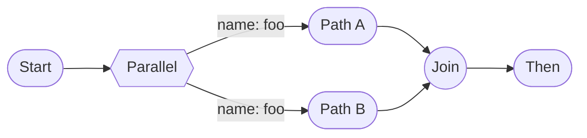
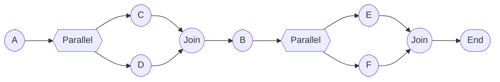

# Parallel Branch Nesting Policy — Scenarios, Decisions, and Parser Rules

Last updated: 2025-10-26

## Scope

Define what kinds of branch nesting we allow in dynamic views, what we reject, and why. Provide concrete examples, parser rules, diagnostics, and minimal test coverage guidance.

Targets:
- Parser (`ViewsParser.ts`) validation
- Compute layer expectations (no change if parser enforces)
- Backward-compat with legacy anonymous parallel (`__parallel`, `isLegacyParallel`)

## Definitions

- Parallel branch (P): a branch collection with kind `parallel` and `paths[]`.
- Alternate branch (A): a branch collection with kind `alternate` and `paths[]`.
- Homogeneous nesting: branch of type X directly contains a single child that is also type X (e.g., P within P, A within A) with no sequential steps before/after inside that path.
- Heterogeneous nesting: different types nested (e.g., A inside P or P inside A).
- Sequential parallel: a parallel block appears as one step among others inside a path, i.e., the path has additional steps before or after the block.

## Diagram symbol legend

This legend explains the Mermaid flowchart shapes and labels used across diagrams.

Nodes (shapes)
- ([Text]) — rounded/stadium node: an atomic step or a simple series placeholder (e.g., `([A])`, `([A→B])`).
- [Text] — rectangle: occasionally used to denote a generic step; interchangeable with rounded for our purposes.
- {{Text}} — parallel block container: denotes a Parallel branch region (e.g., `{{Parallel}}`). Represents an AND-split/AND-join fragment as defined by our semantics.
- [[Text]] — alternate block container: denotes an Alternate/choice region (e.g., `[[Alternate]]`). Represents mutually exclusive paths.
- ((Text)) — join/synchronization point: a visual AND-join indicating that parallel paths converge before continuing (e.g., `((Join))`).

Edges and labels
- --> — directed flow from one node to another.
- -->|label| — labeled edge, used to annotate:
  - Path names for alternate branches (e.g., `--> |path 1|`)
  - Path names within parallel when shown for clarity (optional)
- Multiple outgoing edges from a Parallel or Alternate container indicate its paths.

Conventions
- We show a single explicit join node `((Join))` to emphasize structured concurrency (parallel paths must complete before continuing). The join is conceptual; execution semantics are enforced by the branch construct.
- “Legacy __parallel” labels mark anonymous/legacy syntax; semantics follow the same rules as modern parallel blocks for nesting/flattening.
- When a path or block is said to be “flattened,” it means its inner paths are promoted to the parent Parallel’s `paths` (no extra synchronization level).

### Rendering notes
- GitHub renders Mermaid diagrams in Markdown automatically when fenced with ```mermaid.
- VS Code’s built-in Markdown preview does not render Mermaid by default. Use one of:
  - “Markdown Preview Mermaid Support” extension
  - “Markdown Preview Enhanced” extension
  - Or open this file on GitHub to view the diagrams.

### Legend quick visual (Mermaid)

#### Rounded node


---

#### Join (synchronization)


---

#### Parallel container with two paths


---

#### Alternate container with labeled paths


---

#### Labeled edge example


---

## Summary of decisions

- Disallow homogeneous nested parallel: P directly wrapping P is semantically redundant (associative); parser should reject with a clear diagnostic and suggested fix to flatten.
- Allow sequential parallel: Paths may contain a parallel block followed or preceded by steps. This models "do X, then branch in parallel" and is not the same as nested parallel.
- Allow heterogeneous nesting: Alternate within parallel, or parallel within alternate, is allowed (they have distinct semantics and not generally associative).
- Legacy compatibility: The same rules apply to legacy anonymous parallel blocks. If legacy form degenerates to P-in-P, reject with the same diagnostic.

Rationale: Maintainer guidance in discussion #816 indicates nested parallel "doesn't make sense" due to associativity and should be prevented. Sequential-parallel supports real workflows (structured concurrency) and should remain valid.

## Scenario matrix

Legend: ✓ allowed, ✗ disallowed

1) Flat parallel
- P { paths: [ [A→B], [A→C] ] } → ✓

2) Homogeneous nested parallel (redundant)
- P { paths: [ [ P { paths: [X, Y] } ] , [Z] ] } where the first path contains exactly one P and nothing else → ✗ (reject; suggest flattening X,Y into parent P paths)
- P { paths: [ [ P { … } ] ] } i.e., every path is a single P → ✗

3) Sequential parallel (structured concurrency)
- P { paths: [ [A, P { paths: [X, Y] } ], [B] ] } → ✓
- P { paths: [ [P { paths: [X, Y] }, C] ] } → ✓

4) Heterogeneous nesting
- P { paths: [ [A, A { paths: [X, Y] } ] ] } → ✓
- A { paths: [ [A, P { paths: [X, Y] } ] ] } → ✓

5) Legacy anonymous parallel
- P (legacy) with `__parallel: [Step | Series]` inside P path as the only entry and it is itself P → ✗ (same as #2)
- P (legacy) used sequentially with other steps in the same path → ✓

Notes:
- "exactly one entry" means the path resolves to a single branch entry that is a branch of the same kind and no other steps are present in that path.

## Visual overview (Mermaid diagrams)

### 1) Flat parallel (allowed)


This represents a single parallel block with two paths. Both paths complete before continuing.

### 2) Homogeneous nested parallel (disallowed) vs flattened equivalent

Disallowed (parallel directly wrapping parallel):


Equivalent flattened form (what users should write):


The nested version adds no semantics—flatten inner parallel paths into the parent.

### 3) Sequential parallel (allowed)


This models "do B, then branch into C and D in parallel; when both finish, continue to E".

### 4) Heterogeneous nesting (allowed)

Alternate inside parallel (one path chooses between two alternatives):


Parallel inside alternate (each alternative may run a parallel block):


### 5) Legacy anonymous parallel (allowed when not degenerating to nested parallel)


Legacy anonymous parallel is treated the same for nesting rules: if a path reduces to a single nested parallel, it must be flattened.

## Parser rule proposal

Validation point: in `parseDynamicBranchCollection` after `paths` are constructed.
- If `kind === 'parallel'`, then for each path:
  - If the path `steps` array has length 1 and that single entry is `DynamicBranchCollection` with `kind === 'parallel'`, emit a diagnostic and reject the outer branch (return null) or continue but mark error (preferred: diagnostic + reject to avoid silent ambiguity). Provide a fix suggestion to flatten inner paths into outer `paths`.
- Mirror the same rule for `alternate` in the future if we decide homogeneous nested alternate is also redundant (not enforced yet; out-of-scope if associativity isn’t decided for alternates).

Diagnostic text (proposed):
- Code: `LIKEC4-NESTED-PARALLEL`
- Message: "Nested parallel inside parallel is not allowed. Flatten inner parallel paths into the parent parallel."
- Hint: "Replace this path with the inner parallel’s paths."

Auto-fix (optional, future):
- When safe, auto-rewrite: P { paths: [ [ P { paths: [X, Y] } ], … ] } → P { paths: [ X, Y, … ] }

### Parser decision flow

```mermaid
flowchart TD
  S([parseDynamicBranchCollection]) --> K{kind === 'parallel'?}
  K -- no --> EndAllowed([No special check])
  K -- yes --> ForEach([for each path])
  ForEach --> L{steps.length == 1?}
  L -- no --> NextPath([next path]) --> ForEach
  L -- yes --> T{steps[0] is branch & kind==='parallel'?}
  T -- no --> NextPath
  T -- yes --> Err[[Diagnostic: LIKEC4-NESTED-PARALLEL]]
  Err --> Reject([Reject branch or skip path])
```

## Compute/render implications

- No changes required in compute if parser guarantees the rule; compute already supports sequential blocks and heterogeneous nesting and produces hierarchical IDs and branch trails.
- Disallowing P-in-P reduces degenerate cases and makes UI logic simpler (no need to render nested identical-operator grouping that has no semantic effect).

## Legacy handling (`isLegacyParallel`)

- The `isLegacyParallel` flag is about anonymous syntax compatibility, not semantics. Apply the same P-in-P rule to legacy forms.
- Diagnostic should still trigger when legacy content degenerates to nested parallel. Suggest using named paths and flattening.

## Edge cases to consider

- Empty paths are already warned and skipped.
- Series containing a P-only step: if the series has more than one step, it’s sequential and allowed; if the series degenerates to a single P and that is the only entry in the path, it’s still homogeneous nested P and should be rejected.
- Multiple nested levels: P → path → step is P → path → step is P: reject as soon as a path resolves to a single P entry; otherwise allowed when other steps exist.

Additional candidates (with suggested handling):

1) Degenerate single-path parallel/alternate
- P with exactly one path (after filtering invalid steps) has no branching value.
- Suggested: warn (`LIKEC4-DEGENERATE-PARALLEL`) and consider auto-flatten of that path into the parent sequence. Same for A (`LIKEC4-DEGENERATE-ALTERNATE`).

2) Path name uniqueness within a branch
- Two paths in the same branch have the same `pathName`.
- Suggested: error (`LIKEC4-DUP-PATH-NAME`) or warn if duplicates are allowed but discouraged. Ensure `pathId` remains unique (it’s derived from AST path).

3) Title derivation stability
- Nested branches without explicit titles may derive titles inconsistently (first titled entry wins).
- Suggested: document precedence: explicit > first titled direct step > first titled nested step (DFS). Fallback to `kind#index` (e.g., `parallel#2`). Optional length limit (e.g., 80 chars) truncation with ellipsis.

4) Mixing legacy __parallel with named paths
- A node that specifies both named `paths` and `__parallel` legacy entries.
- Suggested: treat `__parallel` as an additional anonymous path (current behavior). Still apply P-in-P rule if any path reduces to a single nested P.

5) Multiple sequential parallel blocks in the same path
- Path like: `[A, P{…}, B, P{…}, C]`.
- Suggested: allowed. Ensure compute emits correct branchTrail segments for edges before/between/after blocks. Add a test to cover two disjoint parallel segments in one path.

6) Duplicate (identical) steps across sibling paths
- The same step or series appears in multiple paths of a branch.
- Suggested: allow, but consider a low-severity warning (`LIKEC4-DUP-STEP-IN-PATHS`) if duplication is likely unintentional. Compute should register the same edge in multiple paths (by design) when branch collections feature is enabled.

7) Backward steps inside branches
- A backward step (A→B then B→A) appears within a path in P or A.
- Suggested: current parser marks backward; allowed unless there’s a project-wide constraint to disallow backward steps. Consider a warning when backward steps escape the branch and re-enter (complex control flow).

8) Deep nesting limits
- Very deep heterogeneous nesting (e.g., A→P→A→P …) can hurt readability/performance.
- Suggested: soft-limit warning at depth N (configurable, e.g., 5) `LIKEC4-DEPTH-LIMIT`, no hard error. Skip for now; add as a future enhancement if needed.

9) Invalid-step filtering changing structure
- Filtering out invalid steps can transform a path with `[Step, P]` into `[P]`, unintentionally triggering P-in-P rejection.
- Suggested: when rejection is due solely to prior filtering, consider demoting to a warning and auto-flatten instead of hard error. Alternatively, keep as error but improve diagnostic hint: “Previous invalid steps were removed, causing nested parallel.”

10) Alternate-in-alternate (A-in-A) associativity
- We don’t currently enforce a similar rule for A-in-A; semantics may not be associative depending on default path semantics.
- Suggested: leave allowed for now, revisit after UX/semantics review. Add tests to document current behavior.

11) Path metadata completeness
- Anonymous paths without name/title across many branches can degrade UX.
- Suggested: warn when all paths are anonymous and untitled (`LIKEC4-PATH-METADATA-MISSING`), recommending adding `name` or `title` for clarity.

12) Extremely large fan-out
- Parallel with hundreds of paths can overwhelm UI.
- Suggested: warn beyond a configurable threshold (`LIKEC4-PATHS-FANOUT`), no parse error.

13) Unicode and whitespace in titles/names
- Titles with newlines, excessive whitespace, or exotic Unicode.
- Suggested: normalize whitespace (trim, collapse sequences) and allow Unicode. Warn on control characters.

14) Legacy-only nested parallel
- Legacy anonymous P inside legacy anonymous P.
- Suggested: same P-in-P rule applies; diagnostic should guide users to flatten or migrate to named paths.

15) Cross-branch cycles
- Cycles formed by edges across paths or branches (not only simple backward steps).
- Suggested: out-of-scope for parser; leave to higher-level graph validation. Optionally surface a warning if an obvious cycle is detected during parse (if cheap), otherwise defer.

## Edge case diagrams (Mermaid)

### 1) Degenerate single-path parallel (warn, consider flatten)


Single path under Parallel adds no branching value; consider flattening `Only` into the surrounding sequence.

### 2) Degenerate single-path alternate (warn, consider flatten)


### 3) Path name duplicates within a branch (error or warn)



Two paths share the same `pathName` (foo).

### 4) Mixing legacy __parallel with named paths (allowed, apply P-in-P rule)


Treat `__parallel` as an additional anonymous path; still reject if any path collapses to a single nested Parallel.

### 5) Multiple sequential parallel blocks in one path (allowed)



### 6) Duplicate steps across sibling paths (allowed; optional warn)


Both paths reference the same conceptual step series X→Y.

### 7) Backward steps inside a branch (allowed; may warn in complex flows)


Backward steps are recognized; policy may allow with warnings.

### 8) Deep heterogeneous nesting (soft-limit warn)

```mermaid
flowchart LR
  S([Start]) --> ALT1[[Alternate]]
  ALT1 -->|opt 1| P1{{Parallel}}
  P1 --> X([X]) & ALT2[[Alternate]]
  ALT2 -->|case 1| P2{{Parallel}}
  ALT2 -->|case 2| Y([Y])
  P2 --> M([M]) & N([N])
  X --> J1((Join 1))
  M --> J2((Join 2))
  N --> J2
  J2 --> J1
  ALT1 -->|opt 2| Z([Z])
  J1 --> END([Then])
  Z --> END
```

### 9) Invalid-step filtering changing structure (before vs after)

Before filtering (sequential, allowed):

```mermaid
flowchart LR
  S([Start]) --> Step([Step])
  Step --> P{{Parallel}}
  P --> C([C]) & D([D])
  C --> J((Join))
  D --> J
  J --> T([Then])
```

After filtering out `Step` (degenerates to P-only path):

```mermaid
flowchart LR
  S([Start]) --> P{{Parallel}}
  P --> C([C]) & D([D])
  C --> J((Join))
  D --> J
  J --> T([Then])
```

If nested inside another Parallel, this might trigger P-in-P; consider demoting to warning with auto-flatten suggestion.

### 10) Alternate-in-alternate (currently allowed; revisit semantics later)

```mermaid
flowchart LR
  S([Start]) --> ALT1[[Alternate]]
  ALT1 -->|A| ALT2[[Alternate]]
  ALT1 -->|B| B([B])
  ALT2 -->|A1| A1([A1])
  ALT2 -->|A2| A2([A2])
  A1 --> T([Then])
  A2 --> T
  B --> T
```

### 11) Extremely large fan-out (warn beyond threshold)

```mermaid
flowchart TB
  S([Start]) --> P{{Parallel}}
  P --> A([A])
  P --> B([B])
  P --> C([C])
  P --> D([D])
  P --> E([E])
  P --> F([F])
  P --> G([G])
  P --> H([H])
  A --> J((Join))
  B --> J
  C --> J
  D --> J
  E --> J
  F --> J
  G --> J
  H --> J
  J --> T([Then])
```

### 12) Legacy-only nested parallel (disallowed; flatten)

```mermaid
flowchart LR
  S([Start]) --> L1{{Legacy __parallel}}
  L1 --> L2{{Legacy __parallel}}
  L2 --> X([X]) & Y([Y])
  X --> J((Join))
  Y --> J
  J --> T([Then])
```

Treat as P-in-P: flatten inner legacy parallel into the parent.

### 13) Cross-branch cycles (out-of-scope for parser)

```mermaid
flowchart LR
  S([Start]) --> P{{Parallel}}
  P --> A([A])
  P --> B([B])
  A --> J((Join))
  B --> J
  J --> C([C])
  C --> A
```

Cycle involves elements across different paths; handle in higher-level graph validation.

## Test plan (minimal)

Happy path
- parse: P with two simple paths → OK.
- parse: P with sequential parallel in one path (step, then P) → OK.
- parse: A with nested P inside a path → OK.

Rejects
- parse: P with path [P {...}] → diagnostic LIKEC4-NESTED-PARALLEL, branch rejected.
- parse: P with all paths [P {...}] only → diagnostic, reject.

Legacy
- parse: legacy P (__parallel) where a path is [legacy P only] → diagnostic, reject.

Snapshots/fixtures
- Include examples for before/after flattening suggestion.

## Examples (conceptual)

Disallowed (homogeneous nested parallel):

```
parallel {
  paths: [
    [ parallel { paths: [ [A→B], [C→D] ] } ],
    [ E→F ]
  ]
}
```

Allowed (sequential parallel):

```
parallel {
  paths: [
    [ A→B, parallel { paths: [ [C→D], [E→F] ] } ],
    [ G→H ]
  ]
}
```

Allowed (heterogeneous nesting):

```
parallel {
  paths: [
    [ alt { paths: [ [A→B], [C→D] ] } ],
    [ E→F ]
  ]
}
```

## Next steps

- Implement the parser check in `ViewsParser.parseDynamicBranchCollection` for P-in-P.
- Emit diagnostic `LIKEC4-NESTED-PARALLEL` with a clear message and suggested fix.
- Add test cases listed above under `packages/language-server` tests.
- Optionally, consider whether A-in-A should be treated similarly in a follow-up.
