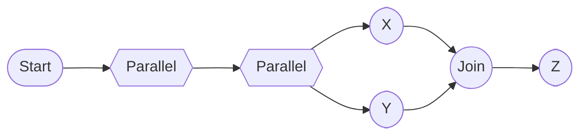
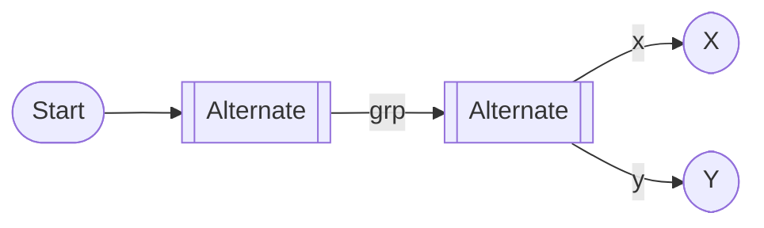
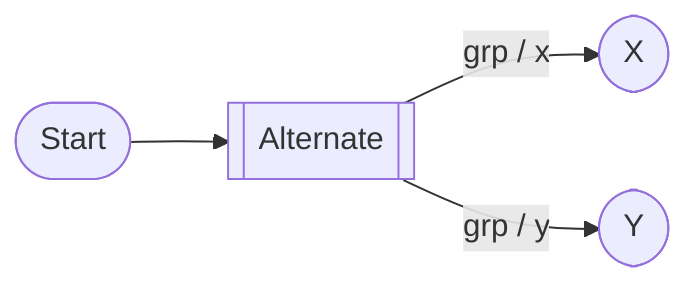

# Unified Branch Collections Policy — Parallel vs Alternate (Compare, Contrast, and Path Forward)

Last updated: 2025-10-26

## Scope and goals

We currently use two different strategies for homogeneous nesting of branch collections:
- Parallel-in-Parallel (P-in-P): disallowed with an error; suggest manual flattening.
- Alternate-in-Alternate (A-in-A): allowed and auto-flattened with an informational diagnostic.

This document compares and contrasts the semantics, explains why the divergence exists, and proposes options to unify behavior. It also outlines diagnostics, parser changes, tests, and a migration plan.

Related docs:
- Parallel policy: `upstream/APPROACH_PARALLEL_NESTING_POLICY.md`
- Alternate policy: `upstream/APPROACH_ALTERNATE_NESTING_POLICY.md`

## Current behavior summary

- Parallel (P)
  - Homogeneous nested parallel: ✗ error (LIKEC4-NESTED-PARALLEL). Rationale: associativity + explicit synchronization barrier; prefer authors to flatten for clarity.
  - Sequential parallel and heterogeneous nesting: ✓ allowed.
- Alternate (A)
  - Homogeneous nested alternate: ✓ allowed but normalized (flattened). Info diagnostic (LIKEC4-NESTED-ALTERNATE-FLAT).
  - Sequential alternate and heterogeneous nesting: ✓ allowed.

## Why they differ

- Core semantics
  - Parallel represents structured concurrency with an implicit AND-join. While A-in-A is purely a choice (associative by construction), P-in-P visually suggests an extra synchronization barrier that adds no behavior. The maintainer guidance favored preventing that pattern early (error) to keep diagrams simple and intent explicit.
  - Alternate has no synchronization boundary; nesting is a grouping convenience and behaviorally equal to flattened form.

- UX considerations
  - For P: Disallowing P-in-P nudges authors to write the minimal, readable form and reduces redundant grouping in UI.
  - For A: Auto-flatten preserves author intent while avoiding busywork; grouping labels can be merged into titles.

## Options to unify behavior

Below are viable unification strategies, with trade-offs.

1) Strict + Strict (error on homogeneous nesting for both P and A)
- Pros: Simple mental model; consistent diagnostics; prevents redundant grouping everywhere.
- Cons: Penalizes legitimate authoring convenience for A; requires manual flattening; more friction for restructuring content.

2) Normalize + Normalize (auto-flatten both P and A)
- Pros: Author-friendly; consistent behavior across branch kinds; easy to maintain.
- Cons: Deviates from the current maintainer guidance to prevent nested P; flattened P-in-P may mask misunderstandings about join placement (even if behaviorally equivalent today).

3) Status quo (Strict for P, Normalize for A)
- Pros: Matches current policy and rationale; keeps P diagrams intentional while making A ergonomic.
- Cons: Asymmetry can confuse users; more code paths and different diagnostics.

4) Configurable policy (project-level setting)
- Example: `project.experimental.dynamicBranchCollectionsPolicy = 'strict' | 'normalize' | 'asymmetric'`
- Pros: Teams can choose what fits their culture; allows gradual rollout from strict→normalize.
- Cons: More configuration and test surface; users might not notice the setting.

5) Context-aware hybrid
- Keep P-in-P as error by default, but automatically flatten when P-in-P arises solely due to previous filtering that removed steps (with a warning). A-in-A stays normalize.
- Pros: Reduces spurious errors from structural transformations; pragmatic.
- Cons: Slightly more complex implementation and messaging than a single policy.

## Recommendation

Short term (near release): Keep the status quo (Option 3) but harmonize messaging and provide quick-fixes.
- P-in-P: error `LIKEC4-NESTED-PARALLEL` with a code action to flatten.
- A-in-A: info `LIKEC4-NESTED-ALTERNATE-FLAT` with a note showing the canonical flattened form and how titles/names are preserved.
- Add an escape hatch env or config to opt into normalization for P (Option 4) to collect feedback: `project.experimental.branchCollections.strictParallelNesting = boolean` (default: true).

Medium term: If telemetry or feedback shows frequent P-in-P with quick-fix usage and low confusion, consider moving to Normalize + Normalize (Option 2) with a one-release deprecation phase.

## Parser and diagnostics plan

- Centralize homogeneous-nesting detection in `ViewsParser.parseDynamicBranchCollection`:
  - Factor out a helper like `detectHomogeneousNesting(kind, path)` that returns the inner-branch when a path has a single same-kind branch entry.
  - For `kind === 'parallel'`: emit error `LIKEC4-NESTED-PARALLEL` (severity error); if `strictParallelNesting` is false, auto-flatten and downgrade to info `LIKEC4-NESTED-PARALLEL-FLAT`.
  - For `kind === 'alternate'`: auto-flatten and emit info `LIKEC4-NESTED-ALTERNATE-FLAT`.

- Diagnostic harmonization
  - Codes:
    - Parallel: `LIKEC4-NESTED-PARALLEL` (error) and optionally `LIKEC4-NESTED-PARALLEL-FLAT` (info when normalize mode is enabled).
    - Alternate: `LIKEC4-NESTED-ALTERNATE-FLAT` (info).
  - Messages:
    - P error: "Nested parallel inside parallel is not allowed. Flatten inner parallel paths into the parent parallel."
    - P info (normalize mode): "Nested parallel inside parallel was flattened into the parent."
    - A info: "Nested alternate inside alternate was flattened into the parent alternate."
  - Hints: Describe how names/titles are preserved (e.g., `parent / child`).

- Metadata preservation
  - On flattening, compose titles/names as `parentTitle + ' / ' + childTitle` when both exist; otherwise keep the one that exists. Ensure `pathId` uniqueness via `astPath` as today.

## Compute and UI impact

- Compute: No functional changes. Both branches produce the same edges after canonicalization.
- UI: Reduced redundant grouping. Titles post-flattening should be displayed as composed labels.

## Migration plan

- Phase 1 (current):
  - Keep P-in-P as error with quick-fix; A-in-A auto-flatten (info).
  - Document the asymmetry clearly in both policy docs and in this unified doc.

- Phase 2 (optional, behind config):
  - Introduce `project.experimental.branchCollections.strictParallelNesting = false` to auto-flatten P-in-P (info) for teams who want symmetry.

- Phase 3 (future, based on feedback):
  - Consider Normalize + Normalize as the default; keep a strict mode for teams that prefer early errors.

## Tests

- Shared detection tests
  - Verify detection triggers for both kinds when a path has a single same-kind branch entry.

- Parallel
  - Strict mode: P-in-P emits error; no flattening.
  - Normalize mode: P-in-P auto-flattens and emits info; path labels composed.

- Alternate
  - Always auto-flattens and emits info; labels composed; snapshot of resulting paths.

- Mixed scenarios
  - Ensure sequential cases are not mis-detected.
  - Filtering-induced nesting: demote or preserve severity per policy; labels composed.

## Visual appendix (Mermaid)

Parallel-in-parallel (strict error by default):

Alternate-in-alternate (auto-flatten):

Flattened canonical form (for either kind in normalize mode):

## Open questions

- Should we ever introduce a visible UI indicator for an implied/flattened group (e.g., small badge) to preserve author grouping intent? Likely no for now.
- Do we need a maximum composed title length and truncation behavior? If so, mirror existing truncation rules.
