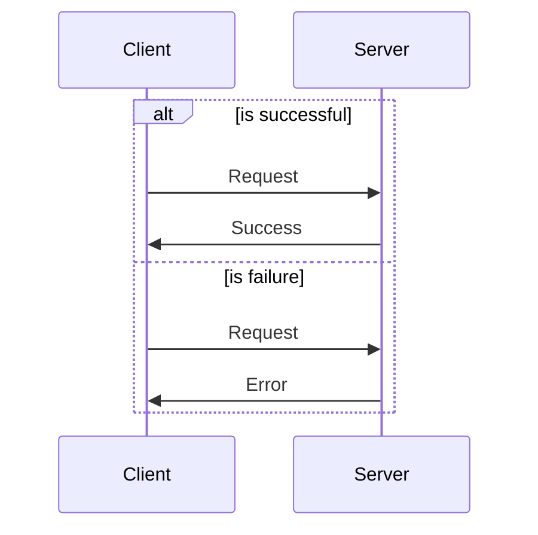

# Feature Request: Alternate Paths for Dynamic Views

**Feature Type**: Enhancement  
**Component**: Dynamic Views  
**Estimated Complexity**: Medium  
**Estimated Effort**: 2-3 days  
**Status**: Ready for Implementation  

---

## Executive Summary

**Request**: Add support for `alternate` paths (OR logic) in dynamic views, complementing the existing `parallel` paths (AND logic).

**Use Case**: Model decision points where one of several mutually exclusive paths is taken based on conditions (e.g., validation pass/fail, payment methods, authentication outcomes, error handling).

**Rationale**: 
- `parallel` models concurrent operations (all paths execute simultaneously)
- `alternate` models decision points (only one path executes)
- Both are fundamental flow control patterns in architecture modeling
- PlantUML and Mermaid sequence diagrams already support `alt/else` blocks
- LikeC4's sequence mode would naturally benefit from this

**Impact**: Enables more expressive dynamic views without requiring multiple separate views for each outcome, reducing maintenance burden and improving documentation clarity.

---

## Motivation & Use Cases

### Problem Statement

Currently, to show decision points with multiple outcomes, users must:

1. **Create separate dynamic views** for each path:
   ```
   - customer-etl-happy-path
   - customer-etl-quality-failure
   - customer-etl-quarantine-recovery
   ```
   
2. **Duplicate common steps** across views (maintenance burden)
3. **Lose visual context** of the decision point itself
4. **Manually document relationships** between views in notes

This becomes verbose and error-prone, especially for simple decision points with short divergent paths.

### Use Case 1: Data Quality Gate (Most Common)

**Scenario**: ETL pipeline with validation step that branches on pass/fail.

**Current workaround** (3 separate views):
```likec4
// View 1: Decision point documentation
dynamic view etl-decision {
  extract -> validate 'Quality check' {
    notes '✅ Pass: see etl-happy-path | ❌ Fail: see etl-failure-path'
  }
}

// View 2: Happy path (duplicates extract -> validate)
dynamic view etl-happy-path {
  extract -> validate
  validate -> normalize
  normalize -> load
}

// View 3: Failure path (duplicates extract -> validate)
dynamic view etl-failure-path {
  extract -> validate
  validate -> quarantine
  quarantine -> alert
}
```

**With `alternate` syntax** (1 view):
```likec4
dynamic view customer-etl {
  extract -> validate
  
  alternate {
    path success "Validation Passed" {
      validate -> normalize
      normalize -> load
    }
    
    path failure "Validation Failed" {
      validate -> quarantine
      quarantine -> alert
    }
  }
}
```

**Benefits**: 
- DRY principle: No duplication of common prefix
- Complete picture: Decision point visible in one view
- Easier maintenance: Change once, not three times
- Better for walkthroughs: User explores both paths interactively

### Use Case 2: Authentication Flow

**Scenario**: Login with multiple outcomes (success, invalid credentials, account locked).

```likec4
dynamic view user-login {
  user -> web_app 'Enter credentials'
  web_app -> auth_service 'Authenticate'
  
  alternate {
    path success "Valid Credentials" {
      auth_service -> user_db 'Query user'
      user_db -> auth_service 'Return user'
      auth_service -> web_app 'Generate JWT'
      web_app -> user 'Redirect to dashboard'
    }
    
    path invalid "Invalid Credentials" {
      auth_service -> web_app 'Return 401'
      web_app -> user 'Show error message'
    }
    
    path locked "Account Locked" {
      auth_service -> web_app 'Return 403'
      web_app -> user 'Show lockout message'
    }
  }
}
```

### Use Case 3: Payment Methods

**Scenario**: E-commerce checkout with multiple payment integrations.

```likec4
dynamic view checkout-payment {
  customer -> checkout_service 'Submit order'
  
  alternate {
    path credit_card "Credit Card" {
      checkout_service -> stripe_service 'Process card'
      stripe_service -> bank_api '3DS verification'
      bank_api -> stripe_service 'Confirm'
      stripe_service -> checkout_service 'Payment successful'
    }
    
    path paypal "PayPal" {
      checkout_service -> paypal_service 'Redirect to PayPal'
      paypal_service -> paypal_service 'User authorizes'
      paypal_service -> checkout_service 'Payment successful'
    }
    
    path wallet "Digital Wallet" {
      checkout_service -> wallet_service 'Apple Pay / Google Pay'
      wallet_service -> checkout_service 'Payment successful'
    }
  }
  
  checkout_service -> order_service 'Confirm order'
}
```

### Use Case 4: Error Handling & Circuit Breaker

**Scenario**: API call with retry logic and fallback.

```likec4
dynamic view api-call-with-retry {
  client -> api_gateway 'Request'
  api_gateway -> backend_service 'Forward request'
  
  alternate {
    path success "Success" {
      backend_service -> api_gateway 'Return 200'
      api_gateway -> client 'Success response'
    }
    
    path retry "Transient Error (Retry)" {
      backend_service -> api_gateway 'Return 503'
      api_gateway -> backend_service 'Retry (attempt 2)'
      backend_service -> api_gateway 'Return 200'
      api_gateway -> client 'Success response'
    }
    
    path circuit_open "Circuit Breaker Open" {
      backend_service -> api_gateway 'Timeout'
      api_gateway -> fallback_service 'Use fallback'
      fallback_service -> api_gateway 'Cached response'
      api_gateway -> client 'Degraded response'
    }
  }
}
```

---

## Proposed Syntax

### Option A: Named Paths (Recommended)

Mirrors the existing `parallel` syntax but with nested `path` blocks:

```likec4
alternate {
  path <name>? <title>? {
    <steps>
  }
  path <name>? <title>? {
    <steps>
  }
  // ... more paths
}
```

**Example**:
```likec4
alternate {
  path success "Validation Passed" {
    validate -> normalize
    normalize -> load
  }
  
  path failure "Validation Failed" {
    validate -> quarantine
    quarantine -> alert
  }
}
```

**Pros**:
- Consistent with `parallel` syntax
- Path names/titles provide clear documentation
- Easy to reference in walkthrough UI
- Optional names allow flexibility

**Cons**:
- One extra nesting level vs parallel

### Option B: Alt/Else Style (PlantUML-inspired)

```likec4
alt <title> {
  <steps>
}
else <title> {
  <steps>
}
```

**Example**:
```likec4
alt "Validation Passed" {
  validate -> normalize
  normalize -> load
}
else "Validation Failed" {
  validate -> quarantine
  quarantine -> alert
}
```

**Pros**:
- Familiar to PlantUML/Mermaid users
- Slightly more concise
- Natural for binary decisions

**Cons**:
- Harder to extend to 3+ paths
- Doesn't support optional path names separately from titles
- Less consistent with existing LikeC4 syntax

### Recommendation: Option A (Named Paths)

**Rationale**:
1. Consistent with `parallel` syntax pattern
2. Supports 2+ paths naturally
3. Path names enable better tooling (IDs, references)
4. More flexible (optional names/titles)

---

## Technical Design

### 1. Grammar Extension (Langium)

**Location**: `packages/language-server/src/like-c4.langium`

**Changes**:
```langium
// Add to DynamicViewBody
DynamicViewBody: '{'
  tags=Tags?
  props+=DynamicViewProperty*
  (
    steps+=(DynamicViewParallelSteps | DynamicViewAlternateSteps | DynamicViewStep) |
    rules+=DynamicViewRule
  )*
'}'
;

// New alternate steps grammar
DynamicViewAlternateSteps:
  ('alternate'|'alt') '{'
    (paths+=DynamicViewAlternatePath)*
  '}'
;

DynamicViewAlternatePath:
  ('path')? name=ID? title=String? '{'
    (steps+=DynamicViewStep)*
  '}'
;
```

**Validation**:
- At least 2 paths required (warning if only 1)
- Each path must have at least 1 step (error)
- Path names must be unique within alternate block (error)

**Estimated Time**: 1-2 hours

### 2. Type System

**Location**: `packages/core/src/types/view-parsed.dynamic.ts`

**New Types**:
```typescript
export interface DynamicStepsAlternate<A extends AnyAux = AnyAux> {
  readonly alternateId: string
  readonly __alternate: NonEmptyReadonlyArray<DynamicStepsAlternatePath<A>>
}

export interface DynamicStepsAlternatePath<A extends AnyAux = AnyAux> {
  readonly pathId: string
  readonly pathName?: string
  readonly pathTitle?: string
  readonly isDefault: boolean
  readonly __steps: NonEmptyReadonlyArray<DynamicStep<A> | DynamicStepsSeries<A>>
}

// Update discriminated union
export type DynamicViewStep<A extends AnyAux = AnyAux> = ExclusiveUnion<{
  Step: DynamicStep<A>
  Series: DynamicStepsSeries<A>
  Parallel: DynamicStepsParallel<A>
  Alternate: DynamicStepsAlternate<A>  // NEW
}>

// Type guard
export function isDynamicStepsAlternate<A extends AnyAux>(
  step: DynamicViewStep<A> | undefined,
): step is DynamicStepsAlternate<A> {
  return !!step && '__alternate' in step && isArray(step.__alternate)
}
```

**Estimated Time**: 1 hour

### 3. Parser Implementation

**Location**: `packages/language-server/src/model/parser/ViewsParser.ts`

**New Parser Method** (mirrors `parseDynamicViewSteps` for parallel):
```typescript
parseDynamicViewAlternateSteps(node: ast.DynamicViewAlternateSteps): c4.DynamicStepsAlternate {
  const alternateId = pathInsideDynamicView(node)
  const __alternate = node.paths.map((path, index) => {
    const pathId = `${alternateId}/path@${index}`
    const __steps = path.steps.map(step => this.parseDynamicStep(step))
    
    invariant(
      isNonEmptyArray(__steps), 
      `Alternate path '${path.name || index}' must have at least one step`
    )
    
    return {
      pathId,
      pathName: path.name,
      pathTitle: path.title,
      isDefault: index === 0, // First path is default
      __steps,
    }
  })
  
  invariant(
    isNonEmptyArray(__alternate), 
    'Alternate must have at least one path'
  )
  
  if (__alternate.length < 2) {
    // Warning, not error (allow single path for development)
    this.accept('warning', 'Alternate should have at least 2 paths', {
      node,
      code: 'alternate-single-path',
      data: { alternateId }
    })
  }
  
  return {
    alternateId,
    __alternate,
  }
}
```

**Integration**: Add to step parsing dispatch logic.

**Estimated Time**: 2 hours

### 4. Compute Layer (Processing)

**Location**: `packages/core/src/compute-view/dynamic-view/compute.ts`

**Processing Logic**:
```typescript
// In step processing loop
for (const step of viewSteps) {
  // ... existing series and parallel handling ...
  
  if (isDynamicStepsAlternate(step)) {
    // For diagram mode: process only default path (first path)
    const defaultPath = step.__alternate[0]!
    let nestedStepNum = 1
    for (const s of defaultPath.__steps) {
      nestedStepNum = processStep(s, nestedStepNum, stepNum)
    }
    stepNum++
    continue
  }
  
  stepNum = processStep(step, stepNum)
}
```

**Design Decision**: In static diagram view, show only the default path (simplest approach). Other paths are available via walkthrough mode.

**Estimated Time**: 3-4 hours

### 5. Layout Layer (Sequence Diagrams)

**Location**: `packages/layouts/src/sequence/layouter.ts`

**Sequence Mode Rendering**:

For sequence diagrams, alternate paths should render as alt/else blocks (standard UML sequence diagram notation):

```
┌─ alt Validation Passed ─────────────┐
│  Validate → Normalize → Load         │
├─ else Validation Failed ─────────────┤
│  Validate → Quarantine → Alert       │
└───────────────────────────────────────┘
```

**Implementation**:
- Add `alternatePrefix` to Step type (similar to `parallelPrefix`)
- Calculate bounding box for alternate block
- Render frame with path labels
- Support 2+ paths (stacked vertically)

**Estimated Time**: 4-6 hours

### 6. Walkthrough UI (React Components)

**Location**: `packages/diagram/src/navigationpanel/walkthrough/`

**State Management** (`diagram-machine.ts`):

```typescript
interface ActiveWalkthrough {
  stepId: StepEdgeId
  parallelPrefix: string | null
  alternateContext?: {
    alternateId: string
    selectedPathIndex: number
    pathStepIndex: number
    availablePaths: Array<{
      pathId: string
      pathName?: string
      pathTitle?: string
      isDefault: boolean
    }>
  }
}
```

**Navigation Logic**:

```typescript
'walkthrough.step': {
  actions: [
    assign(({ context, event }) => {
      // Case 1: Traversing alternate path
      if (context.activeWalkthrough?.alternateContext) {
        const { alternateId, selectedPathIndex, pathStepIndex, availablePaths } = 
          context.activeWalkthrough.alternateContext
        
        const pathSteps = getPathSteps(alternateId, selectedPathIndex)
        
        if (event.direction === 'next') {
          if (pathStepIndex < pathSteps.length - 1) {
            // Next step in path
            return {
              activeWalkthrough: {
                ...context.activeWalkthrough,
                stepId: pathSteps[pathStepIndex + 1].id,
                alternateContext: {
                  ...context.activeWalkthrough.alternateContext,
                  pathStepIndex: pathStepIndex + 1
                }
              }
            }
          } else {
            // Finished path, exit alternate
            const nextStepIndex = findStepAfterAlternate(alternateId)
            return {
              activeWalkthrough: {
                stepId: context.xyedges[nextStepIndex].id,
                parallelPrefix: null,
                alternateContext: undefined
              }
            }
          }
        } else {
          // direction === 'previous'
          if (pathStepIndex > 0) {
            // Previous step in path
            return {
              activeWalkthrough: {
                ...context.activeWalkthrough,
                stepId: pathSteps[pathStepIndex - 1].id,
                alternateContext: {
                  ...context.activeWalkthrough.alternateContext,
                  pathStepIndex: pathStepIndex - 1
                }
              }
            }
          } else {
            // Return to decision point
            return {
              activeWalkthrough: {
                stepId: getDecisionStepId(alternateId),
                parallelPrefix: null,
                alternateContext: {
                  ...context.activeWalkthrough.alternateContext,
                  pathStepIndex: -1  // Special: at decision point
                }
              }
            }
          }
        }
      }
      
      // Case 2: At alternate step (entering)
      const currentStep = context.xyedges[currentStepIndex]
      if (isAlternateStep(currentStep) && event.direction === 'next') {
        const paths = getAlternatePaths(currentStep.id)
        const firstStepInPath = getPathSteps(currentStep.id, 0)[0]
        
        return {
          activeWalkthrough: {
            stepId: firstStepInPath.id,
            parallelPrefix: null,
            alternateContext: {
              alternateId: currentStep.id,
              selectedPathIndex: 0,
              pathStepIndex: 0,
              availablePaths: paths
            }
          }
        }
      }
      
      // Case 3: Regular navigation (existing logic)
      // ...
    }),
    'update active walkthrough',
    'xyflow:fitFocusedBounds',
    'emit: walkthroughStep',
  ],
}
```

**New Event** (path switching):
```typescript
'walkthrough.switchPath': {
  actions: [
    assign(({ context, event }) => {
      if (!context.activeWalkthrough?.alternateContext) {
        return {}
      }
      
      const { alternateId, availablePaths } = context.activeWalkthrough.alternateContext
      const newPathIndex = event.pathIndex
      const firstStepInPath = getPathSteps(alternateId, newPathIndex)[0]
      
      return {
        activeWalkthrough: {
          stepId: firstStepInPath.id,
          parallelPrefix: null,
          alternateContext: {
            ...context.activeWalkthrough.alternateContext,
            selectedPathIndex: newPathIndex,
            pathStepIndex: 0
          }
        }
      }
    }),
    'update active walkthrough',
    'xyflow:fitFocusedBounds',
  ],
}
```

**UI Component** (Path Selector):

```tsx
function PathSelector({ 
  paths, 
  selectedPathIndex, 
  onSelectPath, 
  isAtDecisionPoint 
}: PathSelectorProps) {
  return (
    <Box className="path-selector">
      <Text size="xs" weight={500} color="dimmed">
        {isAtDecisionPoint ? 'Choose a path:' : 'Current path:'}
      </Text>
      
      <Stack spacing="xs">
        {paths.map((path, index) => (
          <Button
            key={path.pathId}
            variant={selectedPathIndex === index ? 'filled' : 'light'}
            size="xs"
            fullWidth
            disabled={!isAtDecisionPoint && selectedPathIndex !== index}
            onClick={() => onSelectPath(index)}
            leftSection={
              selectedPathIndex === index 
                ? <IconCircleFilled size={12} />
                : <IconCircle size={12} />
            }
          >
            {path.pathTitle || path.pathName || `Path ${index + 1}`}
          </Button>
        ))}
      </Stack>
      
      {!isAtDecisionPoint && (
        <Text size="xs" color="dimmed" mt="xs">
          Press Back to return to decision point
        </Text>
      )}
    </Box>
  )
}
```

**Updated Walkthrough Controls**:

```tsx
function ActiveWalkthroughControls() {
  const {
    hasNext,
    hasPrevious,
    currentStep,
    totalSteps,
    alternateContext
  } = useDiagramContext(...)
  
  return (
    <>
      {alternateContext && (
        <PathSelector
          paths={alternateContext.availablePaths}
          selectedPathIndex={alternateContext.selectedPathIndex}
          onSelectPath={(index) => diagram.switchPath(index)}
          isAtDecisionPoint={alternateContext.pathStepIndex === -1}
        />
      )}
      
      <Badge>
        Step {currentStep} of {totalSteps}
        {alternateContext && (
          <> • {alternateContext.availablePaths[alternateContext.selectedPathIndex].pathTitle}</>
        )}
      </Badge>
      
      <Group>
        <Button disabled={!hasPrevious} onClick={() => diagram.walkthroughStep('previous')}>
          Previous
        </Button>
        <Button disabled={!hasNext} onClick={() => diagram.walkthroughStep('next')}>
          Next
        </Button>
      </Group>
    </>
  )
}
```

**Estimated Time**: 6-8 hours

### 7. Testing

**Unit Tests** (Parser/Types):
```typescript
it('parses alternate paths with multiple branches', async ({ expect }) => {
  const { document } = await validate(`
    dynamic view test {
      A -> B
      alternate {
        path success "Success Path" { B -> C -> D }
        path failure "Failure Path" { B -> E -> F }
      }
      D -> G
    }
  `)
  const view = getView(document)
  expect(view.steps[1]).toHaveProperty('__alternate')
  expect(view.steps[1].__alternate).toHaveLength(2)
  expect(view.steps[1].__alternate[0].isDefault).toBe(true)
  expect(view.steps[1].__alternate[0].pathTitle).toBe('Success Path')
  expect(view.steps[1].__alternate[1].pathTitle).toBe('Failure Path')
})

it('warns on alternate with single path', async ({ expect }) => {
  const { diagnostics } = await validate(`
    dynamic view test {
      alternate {
        path single { A -> B }
      }
    }
  `)
  expect(diagnostics).toContainEqual(
    expect.objectContaining({
      severity: 'warning',
      code: 'alternate-single-path'
    })
  )
})

it('errors on alternate path with no steps', async ({ expect }) => {
  const { diagnostics } = await validate(`
    dynamic view test {
      alternate {
        path empty { }
      }
    }
  `)
  expect(diagnostics).toContainEqual(
    expect.objectContaining({
      severity: 'error',
      message: expect.stringContaining('at least one step')
    })
  )
})
```

**Integration Tests** (Walkthrough):
```typescript
it('navigates through alternate path', ({ expect }) => {
  const machine = createDiagramMachine(viewWithAlternate)
  const actor = createActor(machine).start()
  
  // Navigate to alternate step
  actor.send({ type: 'walkthrough.start' })
  actor.send({ type: 'walkthrough.step', direction: 'next' })
  
  // Should be at decision point
  expect(actor.getSnapshot().context.activeWalkthrough?.alternateContext).toBeDefined()
  
  // Enter path
  actor.send({ type: 'walkthrough.step', direction: 'next' })
  expect(actor.getSnapshot().context.activeWalkthrough?.alternateContext?.pathStepIndex).toBe(0)
  
  // Navigate within path
  actor.send({ type: 'walkthrough.step', direction: 'next' })
  expect(actor.getSnapshot().context.activeWalkthrough?.alternateContext?.pathStepIndex).toBe(1)
  
  // Go back to decision point
  actor.send({ type: 'walkthrough.step', direction: 'previous' })
  actor.send({ type: 'walkthrough.step', direction: 'previous' })
  expect(actor.getSnapshot().context.activeWalkthrough?.alternateContext?.pathStepIndex).toBe(-1)
  
  // Switch to different path
  actor.send({ type: 'walkthrough.switchPath', pathIndex: 1 })
  expect(actor.getSnapshot().context.activeWalkthrough?.alternateContext?.selectedPathIndex).toBe(1)
})
```

**E2E Tests** (UI):
- User can see path selector at decision point
- User can select different paths
- User can navigate through selected path
- Back button returns to decision point
- Path indicator shows in step badge

**Estimated Time**: 4-6 hours

---

## Implementation Summary

| Component | Location | Estimated Time | Complexity |
|-----------|----------|----------------|------------|
| Grammar (Langium) | `like-c4.langium` | 1-2 hours | Low |
| Type System | `view-parsed.dynamic.ts` | 1 hour | Low |
| Parser | `ViewsParser.ts` | 2 hours | Low |
| Compute Layer | `compute.ts` | 3-4 hours | Low-Medium |
| Layout (Sequence) | `sequence/layouter.ts` | 4-6 hours | Medium |
| Walkthrough State | `diagram-machine.ts` | 3-4 hours | Medium |
| UI Components | `walkthrough/` | 3-4 hours | Medium |
| Tests | Various | 4-6 hours | Low-Medium |
| Documentation | Docs | 2 hours | Low |
| **Total** | | **23-33 hours** | **2.5-4 days** |

**Realistic Estimate for Experienced Contributor**: **3 days**

---

## Backward Compatibility

### Breaking Changes: None

- New syntax is additive (doesn't modify existing grammar)
- Existing models parse and render identically
- No changes to `parallel`, regular steps, or other features

### Migration Path: N/A

No migration needed. Feature is opt-in via new `alternate` syntax.

### Deprecations: None

---

## Alternatives Considered

### Alternative 1: Use Separate Views (Status Quo)

**Approach**: Document each path as a separate dynamic view.

**Pros**:
- Works today
- No code changes needed
- Each view is simple and focused

**Cons**:
- Verbose: 3+ views for simple decision point
- Maintenance: Update all views when common steps change
- Discovery: How do users know related views exist?
- Context loss: Decision point not visible in any single view

**Why Rejected**: Too cumbersome for common use cases (data quality gates, error handling).

### Alternative 2: Metadata Convention (Tags)

**Approach**: Use tags to mark alternate branches, render them differently.

```likec4
validate -> normalize 'Success' { tags success }
validate -> quarantine 'Failure' { tags failure }
```

**Pros**:
- No grammar changes
- Works within existing LikeC4

**Cons**:
- Both paths shown simultaneously (confusing)
- No clear grouping or nesting
- Doesn't match user mental model (decision point → pick one branch)
- Tag semantics are wrong (tags are for filtering, not control flow)

**Why Rejected**: Doesn't solve the core problem of showing decision logic.

### Alternative 3: External DSL Preprocessor

**Approach**: 1C4D5 adds `alternate` syntax, transpiles to multiple LikeC4 views.

**Pros**:
- Can implement without waiting for upstream
- Can experiment with syntax

**Cons**:
- Adds complexity (preprocessing layer)
- Breaks round-tripping (can't edit generated LikeC4)
- IDE/LSP support harder
- Deviates from upstream LikeC4

**Why Rejected**: Prefer upstream contribution. Preprocessing is last resort.

---

## Open Questions & Design Decisions

### Q1: Should we show ghosted inactive paths in diagram?

**Option A**: Hide inactive paths (simplest)
- Default path shows in diagram
- Other paths hidden
- Path selector shows all options

**Option B**: Show ghosted inactive paths
- All paths visible but dimmed
- Active path highlighted
- Provides more context

**Recommendation**: **Option A** for MVP (simpler rendering), **Option B** as enhancement.

**Rationale**: Simpler to implement, less visual clutter. Can add ghosting later based on user feedback.

### Q2: How to handle alternate in sequence diagram mode?

**Answer**: Render as standard UML `alt/else` blocks.

PlantUML syntax for reference:
```plantuml
alt Validation Passed
  Validate -> Normalize
else Validation Failed
  Validate -> Quarantine
end
```

LikeC4 should render visually equivalent frames with path labels.

### Q3: Can user switch paths mid-traversal?

**Option A**: No, must return to decision point (simpler)
**Option B**: Yes, via path selector always visible (more complex)

**Recommendation**: **Option A** for MVP.

**Rationale**: Matches IcePanel behavior. Simpler state management. Can add mid-traversal switching later if users request it.

### Q4: Should path names be required or optional?

**Recommendation**: **Optional** (more flexible).

**Rationale**:
- Paths can be identified by index if no name given
- Title provides user-facing label
- Name provides stable ID for tooling
- Optional allows quick prototyping

**Syntax**:
```likec4
path success "Validation Passed" { ... }  // name + title
path "Validation Passed" { ... }          // title only
path { ... }                               // neither (path index used)
```

### Q5: How to handle nested alternates?

**Answer**: Support nesting via recursive structure.

**Example**:
```likec4
alternate {
  path outer1 {
    A -> B
    alternate {
      path inner1 { B -> C }
      path inner2 { B -> D }
    }
  }
  path outer2 { A -> E }
}
```

**State Management**: Stack alternate contexts. Each nested alternate has its own context entry.

**Breadcrumb**: "Outer Path 1 → Inner Path 2"

**Complexity**: Medium, but follows existing pattern (nested elements work).

---

## Success Criteria

### Functional Requirements

- [ ] Parser accepts `alternate { path { ... } }` syntax
- [ ] Type system represents alternate paths correctly
- [ ] Diagram mode shows default path
- [ ] Sequence mode renders alt/else blocks
- [ ] Walkthrough allows user to select and traverse paths
- [ ] Back button returns to decision point
- [ ] Path selector shows all available paths
- [ ] Step counter indicates current path
- [ ] Works with existing `parallel` paths (no conflicts)

### Non-Functional Requirements

- [ ] No breaking changes to existing dynamic views
- [ ] Performance: No noticeable slowdown for models without alternates
- [ ] Accessibility: Path selector keyboard navigable
- [ ] Documentation: Examples in DSL reference
- [ ] Tests: >80% coverage for new code
- [ ] Backward compatible: Existing models render identically

### User Experience Goals

- [ ] Intuitive: Users understand decision points without explanation
- [ ] Discoverable: Path options clearly presented
- [ ] Explorable: Easy to navigate and compare paths
- [ ] Maintainable: Single source of truth (no duplicate views)

---

## Documentation Requirements

### DSL Reference

Add section to LikeC4 DSL documentation:

**Alternate Paths in Dynamic Views**

Alternate paths model decision points where one of several mutually exclusive paths is taken:

```likec4
dynamic view myView {
  // Regular steps
  A -> B
  
  // Decision point with alternate paths
  alternate {
    path pathName "Path Title" {
      B -> C
      C -> D
    }
    path anotherPath "Another Option" {
      B -> E
      E -> F
    }
  }
  
  // Paths converge (or continue independently)
  D -> G
}
```

**Walkthrough Behavior**:
- At decision point: Path selector appears with all options
- Default: First path is pre-selected
- Navigation: User can explore each path independently
- Return: Back button returns to decision point

**Syntax**:
- `alternate { ... }`: Defines decision point
- `path name? title? { steps }`: Defines one possible path
- At least 2 paths recommended (warning if only 1)
- Each path must have at least 1 step (error if empty)

### Examples

Add examples to docs:

1. **Data Quality Pipeline** (simple binary decision)
2. **Authentication Flow** (3-way decision)
3. **Payment Methods** (multiple integrations)
4. **Error Handling** (retry logic with fallback)

### Migration Guide: N/A

No migration needed (new feature).

---

## Comparison with Other Tools

### PlantUML Sequence Diagrams

PlantUML supports `alt/else/opt/loop` blocks:

```plantuml
alt Successful case
  Client -> Server: Request
  Server -> Client: Success
else Failure case
  Client -> Server: Request
  Server -> Client: Error
end
```

**LikeC4 Alignment**: Our `alternate` syntax maps naturally to PlantUML `alt/else` in sequence mode.

### Mermaid Sequence Diagrams

Mermaid supports `alt` syntax:



**LikeC4 Alignment**: Same mapping as PlantUML.

### IcePanel Flows

IcePanel provides alternate paths with:
- Visual path selector (⇥ button)
- First path shown by default
- Ghosted inactive paths
- Linear navigation per path

**LikeC4 Alignment**: Our proposed UX closely matches IcePanel's proven pattern.

### Structurizr

Structurizr doesn't have first-class alternate path support in dynamic views. Uses separate views per scenario.

**LikeC4 Advantage**: More expressive than Structurizr for decision points.

---

## Reference Implementation

### Proof of Concept Branch

**Fork**: `likec4/likec4` → `1c4d5-team/likec4`  
**Branch**: `feature/alternate-paths`  
**Status**: To be implemented

### Implementation Phases

**Phase 1: Core Functionality** (Day 1-2)
- Grammar, types, parser
- Basic compute layer (diagram mode)
- Unit tests

**Phase 2: Walkthrough** (Day 2-3)
- State machine updates
- UI components
- Integration tests

**Phase 3: Polish** (Day 3)
- Sequence mode rendering
- Documentation
- E2E tests
- PR preparation

---

## Pull Request Plan

### PR Structure

**PR 1**: Core Functionality (Grammar, Types, Parser)
- Smallest possible change
- No UI changes
- Focus on data model
- Easy to review

**PR 2**: Diagram & Sequence Rendering
- Compute layer updates
- Layout for sequence mode
- Visual rendering logic

**PR 3**: Walkthrough UI
- State machine
- React components
- User interaction

**Rationale**: Incremental PRs are easier to review and test. Each PR is independently valuable.

### Merge Strategy

1. **Fork likec4/likec4** → `1c4d5-team/likec4`
2. **Implement on feature branch**: `feature/alternate-paths`
3. **Test thoroughly** with 1C4D5 use cases
4. **Submit PRs incrementally** to upstream `likec4/likec4`
5. **Address review feedback** from maintainers
6. **Keep fork in sync** with upstream main branch
7. **Use fork in production** until PRs merged upstream

---

## Risk Assessment

### Technical Risks

| Risk | Likelihood | Impact | Mitigation |
|------|------------|--------|------------|
| Breaking existing dynamic views | Low | High | Extensive backward compat tests |
| Performance regression | Low | Medium | Benchmark before/after |
| State machine complexity | Medium | Medium | Thorough unit tests, XState best practices |
| Layout calculation bugs | Medium | Low | Visual regression tests |

### Process Risks

| Risk | Likelihood | Impact | Mitigation |
|------|------------|--------|------------|
| Upstream rejects PR | Low | Medium | Early discussion, RFC-style proposal |
| Review takes long time | Medium | Low | Incremental PRs, clear documentation |
| Maintainer has different vision | Low | Medium | Flexible design, willing to adapt |
| Need to maintain fork long-term | Low | Low | Keep fork minimal, sync regularly |

---

## Appendix: Code References

### Existing Parallel Implementation

**Grammar**:
```langium
DynamicViewParallelSteps:
  ('parallel'|'par') '{'
    (steps+=DynamicViewStep)*
  '}'
;
```

**Type**:
```typescript
export interface DynamicStepsParallel<A extends AnyAux = AnyAux> {
  readonly parallelId: string
  readonly __parallel: NonEmptyReadonlyArray<DynamicStep<A> | DynamicStepsSeries<A>>
}
```

**Parser**:
```typescript
parseDynamicViewSteps(node: ast.DynamicViewParallelSteps): c4.DynamicStepsParallel {
  const parallelId = pathInsideDynamicView(node)
  const __parallel = node.steps.map(step => this.parseDynamicStep(step))
  invariant(isNonEmptyArray(__parallel), 'Dynamic parallel steps must have at least one step')
  return { parallelId, __parallel }
}
```

**Processing**:
```typescript
if (isDynamicStepsParallel(step)) {
  let nestedStepNum = 1
  for (const s of step.__parallel) {
    nestedStepNum = processStep(s, nestedStepNum, stepNum)
  }
  stepNum++
  continue
}
```

### Walkthrough State Machine

**Location**: `packages/diagram/src/likec4diagram/state/diagram-machine.ts`

**Event**:
```typescript
| { type: 'walkthrough.step'; direction: 'next' | 'previous' }
```

**State**:
```typescript
interface ActiveWalkthrough {
  stepId: StepEdgeId
  parallelPrefix: string | null
}
```

**Navigation**:
```typescript
'walkthrough.step': {
  actions: [
    assign(({ context, event }) => {
      const stepIndex = context.xyedges.findIndex(e => e.id === context.activeWalkthrough!.stepId)
      const nextStepIndex = clamp(
        event.direction === 'next' ? stepIndex + 1 : stepIndex - 1,
        { min: 0, max: context.xyedges.length - 1 }
      )
      return {
        activeWalkthrough: {
          stepId: context.xyedges[nextStepIndex]!.id,
          parallelPrefix: getParallelStepsPrefix(context.xyedges[nextStepIndex]!.id),
        },
      }
    }),
  ],
}
```

---

## Contact & Coordination

**Requesting Team**: 1C4D5 Project  
**Implementation Team**: [To be assigned]  
**Timeline**: 3 days implementation + 1-2 weeks review  
**Fork Repository**: `1c4d5-team/likec4` (branch: `feature/alternate-paths`)  
**Upstream Target**: `likec4/likec4` (main branch)  

**Questions?** Open discussion in LikeC4 GitHub or contact 1C4D5 team.

---

**Document Version**: 1.0  
**Last Updated**: 2025-01-XX  
**Status**: Ready for Implementation
